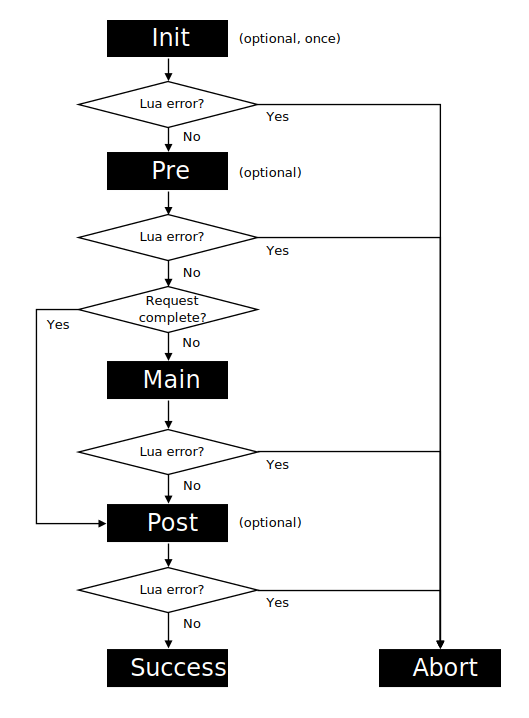

# LWS Request Processing

This document describes the general HTTP request processing logic of LWS.

Request processing involves up to four Lua chunks: an init chunk, a pre chunk, a main chunk, and
a post chunk. These chunks are run sequentially in the execution environment, and they are allowed
to block execution. During the processing of a request, the chunks have exclusive, uninterrupted
access to the Lua state of the AWS Lambda execution environment.

## Init Lua Chunk

The init Lua chunk is run only once per Lua state. This optional chunk provides the opportunity
to initialize a Lua state and set up shared resources for requests, such as database connections.

> [!NOTE]
> The init Lua chunk runs with the *global* environment of the Lua state.

## Pre, Main, and Post Lua Chunks

The pre, main, and post Lua chunks are run sequentially for each request. The optional pre and
post chunks provide the opportunity to perform common tasks for the main chunks of the AWS Lambda
function, such as establishing a context or performing logging.

> [!NOTE]
> The pre, main, and post Lua chunks run with a *request* environment that indexes the global
> environment for keys that are not present. When a request is finalized, the request environment
> is removed.

## Request Environment

The request environment initially provides the values `request` and `response`. These table values
manage information pertinent to the HTTP request.

### `request` Value

| Key            | Type          | Description                                                             | 
| -------------- | ------------- | ----------------------------------------------------------------------- |
| `method`       | `string`      | HTTP request method                                                     |
| `path`         | `string`      | HTTP request path                                                       |
| `args`         | `string`      | HTTP request query parameters                                           |
| `headers`      | `table`-like  | HTTP request headers (case-insensitive keys, read-only)                 |
| `body`         | `file`        | HTTP request body (Lua file handle interface, read-only)                |
| `path_info`    | `string`      | Path info, as defined with the `LWS_PATH_INFO` environment variable     |
| `ip`           | `string`      | Remote IP address of the request                                        |
| `raw.headers`  | `table`-like  | Raw request headers from AWS Lambda (case-insensitive keys, read-only)  |
| `raw.body`     | `table`-like  | Raw request body from AWS Lambda (parsed JSON document, read-only)      |

### `response` Value

| Key        | Type          | Description                                                 |
| ---------- | ------------- | ----------------------------------------------------------- |
| `status`   | `integer`     | HTTP response status (defaults to 200)                      |
| `headers`  | `table`-like  | HTTP response headers (case-insensitive keys)               |
| `body`     | `file`        | HTTP response body (Lua file handle interface, write-only)  |

## Chunk Result

A chunk must return no value, `nil`, or an integer as its result.

No value, `nil`, and `0` indicate success.

A negative integer result indicates failure and generates a Lua error. Results that are neither
`nil`, an integer, or convertible to an integer are processed as `-1` and thus generate a Lua
error as well.

A positive integer result from the pre or main chunk instructs the custom runtime to send an error
response for the corresponding HTTP status code. For example, returning `lws.status.NOT_FOUND`
(or, equivalently, `404`) sends a "Not Found" response. Positive integers outside the range of 100
to 599 are processed as `500` and thus send an "Internal Server Error" response. Returning a
positive integer result from the pre chunk additionally marks the request as *complete* (see
below).

A positive integer result from the init or the post chunk is ignored.

> [!IMPORTANT]
> Most main chunks produce a response body directly and must set `response.status` rather than
> returning an HTTP status code. Returning an HTTP status code *replaces* any response body
> written by the chunk with the error response.

## Processing Sequence

Generally, the Lua chunks are run in the order init (as required), pre, main, and post. All chunks
except the main chunk are optional.

If any chunk generates a Lua error, be it directly or indirectly through its result, the processing
is aborted.

If the pre chunk marks the request as *complete*, processing proceeds directly to the post chunk,
skipping the main chunk. The pre chunk can mark the request as complete by instructing the server
to send an error response (see above) or by calling the `setcomplete`
[library function](Library.md) with this effect.

The following figure illustrates the request processing sequence.

## HTTP Cookies

The `request.headers` and `response.headers` tables provide access to HTTP request and response
headers, respectively. Cookies sent with the request are folded into the `Cookie` request header,
i.e., separated by commas if more than one cookie is present. To set cookies in the response, the
`Set-Cookie` response header can be set to a string with the (folded) cookie value(s) to set. The
custom runtime ensures proper processing of folded cookies so that individual `Set-Cookie` headers
are sent in the ultimate HTTP response.

## HTTP Response Streaming

HTTP response streaming requires that the AWS Lambda function URL is configured with a response
mode of `RESPONSE_STREAM`. A (partial) response body written to `response.body` is streamed by
calling the `response.body:flush` method. The method can be called repeatedly as new body content
is written. Calling the method also *seals* the response, making its status and headers read-only.
A positive integer result from the main chunk is ignored in streaming mode, and error responses are
not sent.

## Raw Request 

The raw request headers and body from AWS Lambda are available in the `request.raw.headers` and
`request.raw.body` values, respectively. These values are read-only. The headers can be indexed
with case-insensitive string keys and iterated with `pairs`. The body is a parsed JSON document
represented as a table-like value. JSON objects support field access by string keys and iteration
with `pairs`. JSON arrays support access by integer indices, the `#` operator, and iteration with
`ipairs`. For example, the statement `for i, v in ipairs(request.raw.body.cookies) do ... end`
iterates over the cookies present in the raw request body. (In Lua 5.1, the `lws.pairs` and 
`lws.ipairs` functions must be used.)

> [!IMPORTANT]
> The `request.raw` value is specific to LWS for AWS Lambda and is not supported in LWS for NGINX.
> You should use the non-raw `request` values for typical HTTP request processing. The
> `request.raw` values are provided to support use cases such as the raw procesinng mode (see
> below), extracting the AWS Lambda request deadline from the raw request headers, or accessing
> additional information supplied by AWS Lambda in the request context. Please see
> [Using the Lambda runtime API for custom runtimes](https://docs.aws.amazon.com/lambda/latest/dg/runtimes-api.html)
> for more information about the raw request headers, and
> [Invoking Lambda function URLs](https://docs.aws.amazon.com/lambda/latest/dg/urls-invocation.html)
> for more information about the raw request body in the context of AWS Lambda function URLs.

> [!WARNING]
> In the default processing mode for AWS Lamba function URLs, the runtime presently decodes a
> base64-encoded request body inplace, implying that `request.raw.body.body` likely contains
> invalid data if `request.raw.body.isBase64Encoded` is `true`. This is an implementation detail
> that may change in future versions. To access the HTTP request body of an AWS Lambda function
> URL, the `request.body` value should be used, as generally noted above.

## Raw Processing Mode

The raw processing mode is enabled by setting the `LWS_RAW` environment variable to `on`. In this
mode, the custom runtime skips the HTTP semantics processing of AWS Lambda function URLs and
provides the raw request to the Lua service. Consequently, in the `request` table, only the `raw`
key is valid, and in the `response` table, only the `body` key is valid. If the Lua service
produces a response body, it must be a valid JSON document; if no response body is produced, the
custom runtime supplies `null` as the response body.

> [!TIP]
> The raw processing mode is useful for implementing non-HTTP services, such as those driven by
> AWS Lambda event source mappings. 

## Lifecycle of the Lua State

By default, the Lua state of an AWS Lambda execution environment is kept open to handle subsequent
requests after a request is finalized.

> [!CAUTION]
> Developers must be careful not to leak information among requests, such as through the global
> environment or the Lua registry. Any request-specific state should be constrained to the request
> environment and local variables.

You can control the lifecycle of the Lua state with the `LWS_REQ_MAX`
[environment variable](EnvironmentVariables.md), and with the `setclose`
[library function](Library.md). Moreover, if processing is aborted due to a Lua error, the Lua
state of the execution environment is closed after finalizing the request.

After the Lua state has been closed, the next request handled by the execution environment creates
a new Lua state, which runs the init chunk (if any) before processing the request.
